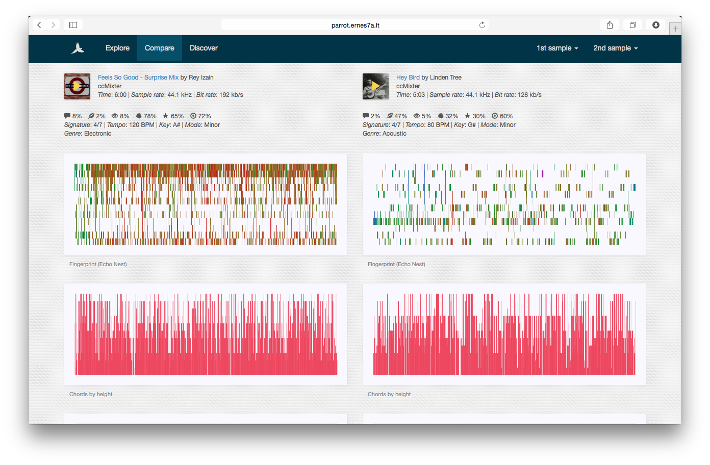

# Parrot
# [Parrot](http://parrot.ernes7a.lt)

Parrot is a BSc thesis project that tried to summarise and visualise popular Western music. This here includes some Python code that can analyse MP3 files and spit out thousands of numbers, and a JavaScript-heavy website that can read those numbers and turn them into things colourful and pretty.

For those curious about the finer details of the project, my paper [Visual Fingerprints: Identifying, Summarizing and Comparing Music](http://papers.ssrn.com/sol3/papers.cfm?abstract_id=2373133) is available for everyone to read and enjoy.

## Libraries
+ The processing component relies on [PyMIR](https://github.com/jsawruk/pymir), [eyeD3](http://eyed3.nicfit.net/), [pyen](https://github.com/plamere/pyen) and [pyLast](https://code.google.com/p/pylast/). On top of that, PyMIR and pyen will get you to install a bunch of other libraries.
+ The visualization component depends on [jQuery](http://jquery.com/) and [D3.js](http://d3js.org/). By the way, D3.js is (redacted) amazing.
+ The application is built with [Bootstrap](http://getbootstrap.com/). Elegance guaranteed. HTML5 audio works with some [jPlayer](http://jplayer.org/) magic.

## Attributions
The `data` directory includes several music tracks (all licenses CC BY-NC 3.0):

+ [October](http://ccmixter.org/files/doxent/43635) by Doxent Zsigmond
+ [Feels So Good - Surprise Mix](http://ccmixter.org/files/Rey_Izain/43892) by Rey Izain
+ [Hey Bird](http://ccmixter.org/files/Michael_Lindentree/43826) by Linden Tree
+ [Test Drive](http://ccmixter.org/files/Zapac/26047) by Zapac

The app uses a [parrot](http://thenounproject.com/noun/parrot/#icon-No8601) icon designed by [nikki rodriguez](http://thenounproject.com/nrodriguezlima) from The Noun Project.

## Author
**Ernesta Orlovaitė**

+ [ernes7a.lt](http://ernes7a.lt)
+ [@ernes7a](http://twitter.com/ernes7a)

## Screenshot
 
